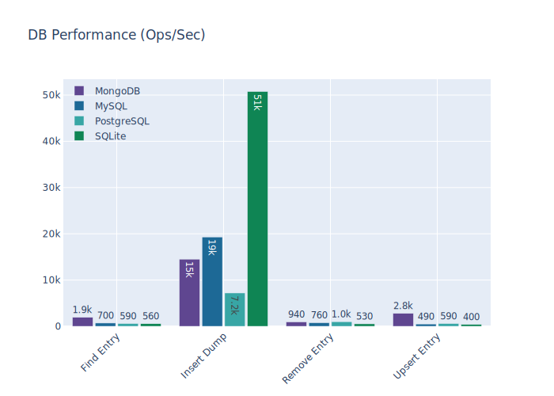
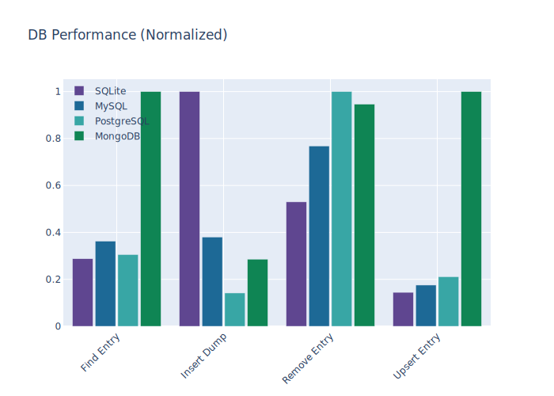

# Database performance

This benchmark report was generated by [main.py](main.py).

|            | Find Entry | Insert Dump | Remove Entry | Upsert Entry |
| :--------- | :--------: | :---------: | :----------: | :----------: |
| MongoDB    |  1,373.88  |  14,199.87  |    572.77    |   2,516.66   |
| MySQL      |   649.42   |  14,636.07  |    885.60    |    373.24    |
| PostgreSQL |   689.94   |  7,230.86   |    897.67    |    547.85    |
| SQLite     |   487.21   |  44,137.56  |    469.26    |    372.24    |

## Lets add some colors!

|            | Find Entry | Insert Dump | Remove Entry | Upsert Entry |             Mean Result              |
| :--------- | :--------: | :---------: | :----------: | :----------: | :----------------------------------: |
| MongoDB    |  1,373.88  |  14,199.87  |    572.77    |   2,516.66   |             :thumbsdown:             |
| MySQL      |   649.42   |  14,636.07  |    885.60    |    373.24    |             :thumbsdown:             |
| PostgreSQL |   689.94   |  7,230.86   |    897.67    |    547.85    |             :thumbsdown:             |
| SQLite     |   487.21   |  44,137.56  |    469.26    |    372.24    | :strawberry::strawberry::strawberry: |

## Or a ranking?

|            | Find Entry | Insert Dump | Remove Entry | Upsert Entry | Upsert Entry Ranking |
| :--------- | :--------: | :---------: | :----------: | :----------: | :------------------: |
| MongoDB    |  1,373.88  |  14,199.87  |    572.77    |   2,516.66   |  :1st_place_medal:   |
| MySQL      |   649.42   |  14,636.07  |    885.60    |    373.24    |  :3rd_place_medal:   |
| PostgreSQL |   689.94   |  7,230.86   |    897.67    |    547.85    |  :2nd_place_medal:   |
| SQLite     |   487.21   |  44,137.56  |    469.26    |    372.24    |         # 4          |

## Define a baseline and see the gains!

|            | Find Entry | Mean Gains |
| :--------- | :--------: | :--------: |
| SQLite     |   487.21   |     1x     |
| MySQL      |   649.42   |   1.33x    |
| PostgreSQL |   689.94   |   1.42x    |
| MongoDB    |  1,373.88  | **2.82x**  |

## Render charts with Plotly!

